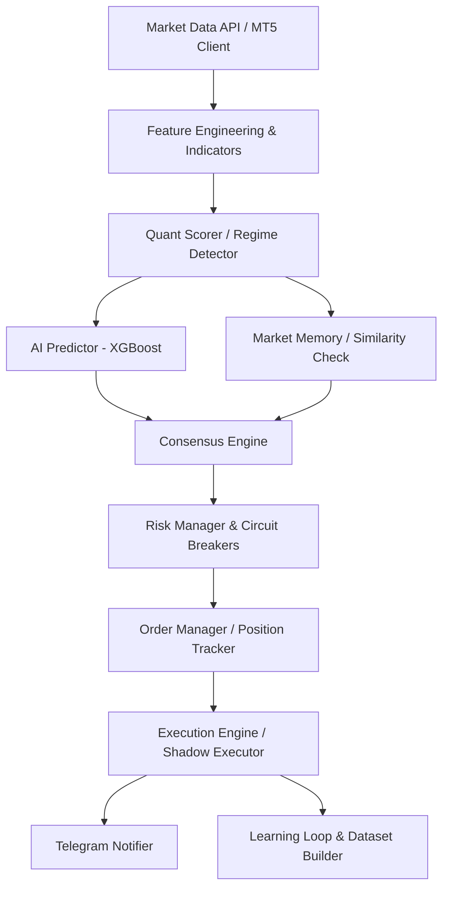

# System Architecture

## System Overview
แผนภาพการทำงานของระบบ:

## Components

- **Predictor**: โมเดล XGBoost ที่ถูกรันบนข้อมูลสด ทำการพยากรณ์ความน่าจะเป็น (Probability) ของทิศทางที่ระบบ Quant แนะนำ หากผลประเมินออกมาต่ำกว่า 0.55 ระบบจะทิ้งออเดอร์
- **Market Memory**: เก็บฐานข้อมูลเวกเตอร์ของออเดอร์ที่ชนะในอดีต (`.npy`) นำสถานการณ์ล่าสุดมาแปลงเป็นเวกเตอร์และหาค่าความคล้ายคลึง (Cosine Similarity) เพื่อหา Setup ที่มีโอกาสทำกำไรสูง
- **Risk Manager**: จัดการขนาดของออเดอร์ (Position Sizing) อ้างอิงตามค่า Stoploss Points ความมั่นใจของ AI และ Health Score ของโมเดล พร้อมระบบ Circuit Breaker ช่วยดักข่าวเศรษฐกิจ
- **Order Manager**: (`positions/tracker.py`) ตรวจสอบสถานะและซิงโครไนซ์ตำแหน่งออเดอร์เปิด/ปิดกับระบบ MT5 บันทึกข้อมูลและเรียกใช้การแจ้งเตือน
- **Backtester**: ระบบทดสอบย้อนหลังในฝั่ง `gqos/backtest` ใช้สำหรับค้นหา Alpha ชุดใหม่ พิสูจน์ผล PBO และ SPA แบบเข้มงวด
- **Dataset Builder**: สร้างชุดข้อมูลสอน ML จาก History ข้อมูลราคาในอดีต ผนวกเข้ากับ Label จากผลเทรดที่เกิดขึ้น
- **Multi Market Scanner**: [TODO] โมดูลสำหรับการลูปดึงข้อมูลจากหลายๆ Symbol พร้อมกัน (ณ ตอนนี้ยังผูกกับแค่ `settings.SYMBOL`)

## Data Flow
1. บอทลูปดึงข้อมูลแท่งเทียน 500 แท่งล่าสุดจาก MT5
2. ถ้ามีแท่งเทียนปิดตัว (Closed Candle) เกิดขึ้น ข้อมูลจะไหลไปยัง `IndicatorCalculator` และ `RegimeDetector`
3. `MarketScoreCalculator` สรุปคะแนนการเป็นเทรนด์ เบรคเอาท์ รีเวอร์ซัล รวมเป็นคะแนนสุทธิ และเลือกทิศทาง BUY / SELL
4. คำนวณ Feature Distance และเรียกให้ `ml_predictor.predict()` ทำงาน หากไม่ผ่าน Probability Threshold ระบบจะปัดตก
5. เรียก `market_memory.get_similarity()` ให้ส่งค่า Similarity กลับมา
6. เช็ค `CircuitBreaker` และข่าว `EconomicFilter`
7. คำนวณ Volume โดยใช้ `RiskManager.calculate_position_size` หากคำนวณออกมาเป็น 0 ระบบจะข้าม
8. ส่งคำสั่งยิงไปที่ `Executor.execute_trade()` เพื่อเปิดออเดอร์จริง หรือ `ShadowExecutor` หากอยู่ในโหมดจำลอง
9. `TelegramNotifier` ดักจับและรายงานสถานะ

## Scaling Plan
สถาปัตยกรรมถูกออกแบบให้แยกระหว่าง Data, ML Inference, และ Execution เพื่อในอนาคตจะสามารถรองรับ Multi-Market โดยโครงสร้างใหม่จะสนับสนุนตลาดเหล่านี้:
- **Forex**: EURUSD, GBPUSD, USDJPY
- **Metals**: XAUUSD, SILVER
- **Indices**: NASDAQ, S&P500
- **Crypto**: BTCUSD, ETHUSD
- **Energies**: OIL

**การรองรับการเพิ่มตลาดใหม่ในอนาคต**: 
- เปลี่ยน `settings.SYMBOL` เดี่ยวเป็น `symbol_config.yaml`
- ดึง MT5 Terminal ให้อนุญาตดึงข้อมูลขนานกันได้ (Concurrency) หรือลูปคิว (Queue)
- AI โมเดลจะถูกสร้างแยกสำหรับแต่ละ Class สินทรัพย์ (เช่น `xgb_crypto.pkl`, `xgb_metals.pkl`)
